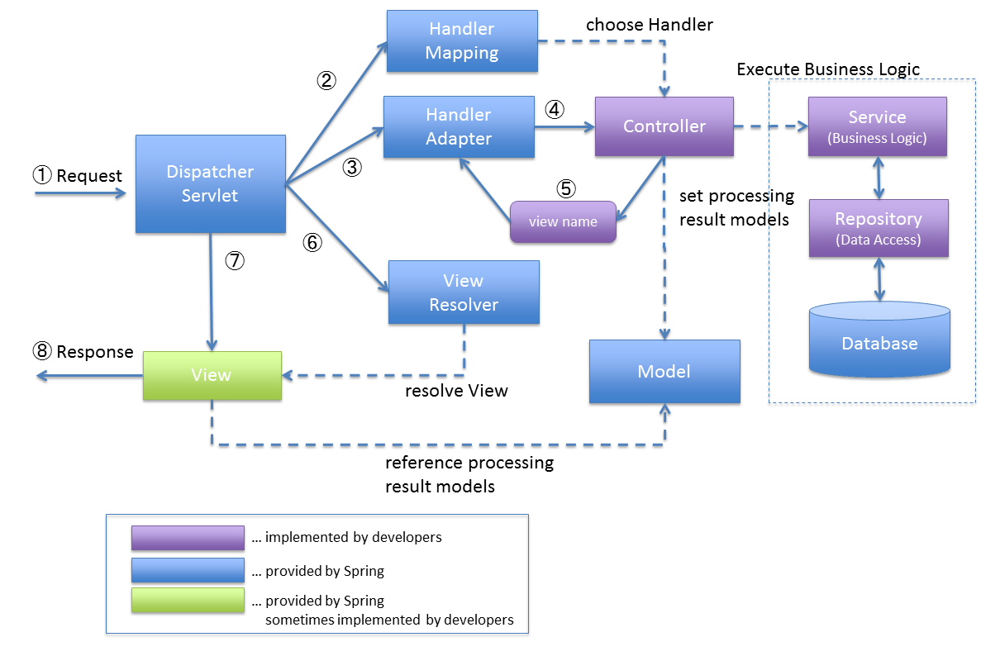
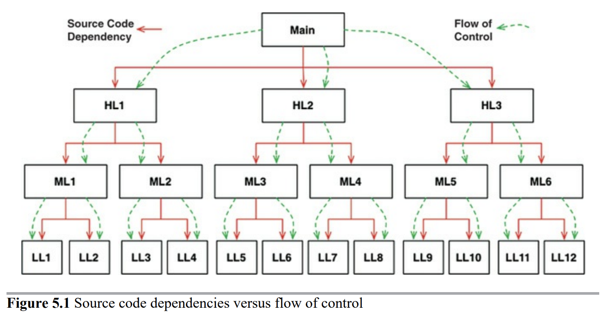

약 8개월 간의 우아한테크코스를 진행하면서 배우고, 또 고민한 것 중 하나는, 소프트웨어의 책임을 어떻게 분리할 것인가에 관한 것이었다. 레벨 1 당시에는 콘솔 프로그래밍으로 도메인을 어떻게 구성할 것인지에 대해 다루었다. 레벨 2 로 넘어와서는 [Spark Java](https://sparkjava.com/) 와 Spring을 추가하면서 도메인을 안정적으로 만드는 것이 왜 중요한지에 대해 학습하였고, 레벨 3에 이르러서는 JPA를 사용하면서 데이터베이스를 연결했을 때 겪는 문제점들을 ORM이 어떻게 풀어나가는지 배웠다.

정리하자면, 어떻게 하면 도메인을 잘 만들 수 있는지, 그리고 이 도메인을 외부 환경으로부터 어떻게 격리하여 흔들리지 않게 만들 수 있는지를 학습하는 과정이었다. 그런데 잠깐, 여기서 도메인이란 무엇일까 ?

## 도메인에 대한 정의
도메인은 결국, "내가 문제를 해결하고자 하는 영역"으로 정의할 수 있다. 가령 쇼핑몰 사이트를 만든다고 하면, 쇼핑의 대상이 되는 상품과 이에 따른 주문/결제 시스템이 바로 도메인이다. 이 과정에서 사용되는 `jackson`과 같은 라이브러리들은 나의 관심사가 아니다. 한편, `jackson`과 같은 소프트웨어를 만든다고 하면, 이러한 직렬화/역직렬화 과정을 처리하는 과정이 도메인이다.

> 나는 도메인에 도움을 주는 이런 부가 기술들을 **'코드 레벨'**, 혹은 **'코드 관점'** 이라고 표현하는데, 정확한 용어가 있는지는 모르겠다.

그렇다면 왜 도메인이 중요할까 ? 우리가 소프트웨어로 문제를 해결하고자 하는 이유는, 만들어낸 소프트웨어가 **가치를 창출**해내기 때문이다. 주어진 문제를 코드로 해결하기 위해선 여러 방법이 존재한다. main 메소드에 수천라인의 코드를 박아넣을 수도 있고, 단 하나의 데이터베이스 쿼리로 해결할 수도 있다. 단 한번만 만들어지고, 절대 변하지 않을 예정이라면 이렇게 해도 문제가 되지 않을것이다. 문제가 되는 경우는, 나를 포함한 누군가가 이 코드를 수정해야할 일이 생겼을 때 발생한다.

그리고 이러한 코드를 특정한 곳에 모아두지 않으면, 새로운 요구사항을 반영하고, 버그를 수정할 때 여러 곳을 살펴봐야 한다. 사람의 인지능력은 한계가 있기 때문에 수백개가 넘어가는 클래스와 수천, 수만 라인의 코드를 모두 파악하는 것은 어렵다. **'관심사의 분리'** 라는 개념이 바로 여기서 등장한다.

> 이에 비해 단기 기억은 보관돼 있는 지식에 직접 접근할 수 있지만 정보를 보관할 수 있는 속도와 공간적인 측면 모두에서 제약을 받는다. 공간적인 제약은 조지 밀러(George Miller)의 매직넘버 7(7 ± 2 규칙)로 널리 알려져 있다. 조지 밀러의 이론에 따르면 사람이 동시에 단기 기억 안에 저장할 수 있는 정보의 개수는 5개에서 많아 봐야 9개 정도를 넘지 못한다고 한다.  
> 또한 허버트 사이먼(Herbert A. Simon)에 따르면 사람이 새로운 정보를 받아들이는 데 5초 정도의 시간이 소요된다고 한다. 컴퓨터 프로그램을 작성할 때는 시간과 공간의 트레이드오프를 통해 효율을 향상시킬 수 있지만 사람의 경우에는 트레이드오프의 여지가 전혀 없다. 사람의 단기 기억에 있어 시간과 공간의 두 측면 모두가 병목지점으로 작용하는 것이다.  
> (출처 : 오브젝트, 조영호 저)


그리고 이러한 비즈니스 규칙을 모아놓는 곳, 소프트웨어의 본질과 정수를 담아둔 곳이 바로 도메인이다. 그렇기에 우리는 **도메인을 보호**하고, **변경의 여지가 높은 외부 환경으로부터 격리하는 것**을 두 번째 우선순위로 잡아야한다. (*당연히 첫 번째는, 올바르게 동작하는 것이다.*)


## 레이어드 아키텍처

도메인이 가장 중요하고, 우리가 보호해야할 대상이란 점은 알았다. 이번에는 practical 한 이야기를 해보자. 바로 이 글의 타이틀에도 작성되어 있는 레이어드 아키텍쳐이다. 레이어드 아키텍쳐는 `Spring MVC` 에서 주로(그리고 거의 대부분) 채택되는 아키텍쳐이기도 하다. 우리에게는 `@Controller`, `@Service`, `@Repository` 과 같은 친숙한 어노테이션으로도 알려져있다. 


> 참고로 위 세 개의 어노테이션을 들어가보면 모두 `DDD` 에 어느정도 근간을 두고 있음을 알 수 있다.

구글에 layered architecture 를 검색해보면 여러 글이 나오지만, 결국 논하고자 하는 바는 "의존성은 한 쪽으로만 이루어져야 한다"는 것이다. 가령 컨트롤러에서 레포지토리를 곧바로 의존한다고 하더라도 순수한 레이어드 아키텍쳐 관점에서는 문제가 되지 않는다. 컨트롤러는 레포지토리보다 상위에 위치한다.

 

이제 각 세 개의 레이어가 중점적으로 다뤄야 할 관심사에 대해서 알아보겠다.

> 참고로 본 글에서는 `presentation == controller`, `application == service` 로 취급한다.

### Controller
컨트롤러는 외부 API 요청을 받아내는 역할을 한다. 개발자 입장에서는 외부 통신을 받아내는 가장 첫 번째 관문이기도 하다.(물론 interceptor나 filter 도 있긴 한다만, 여기선 신경쓰지 않겠다.) 컨트롤러 level 에서 주로 처리해야할 사항은 주로 '코드 관점'에 집중되어 있다. 내가 원하는 올바른 값이 들어 왔는지? 올바른 사용자가 요청을 보낸 것인지? 내가 원하는 양식(e.g. json)대로 값을 요청했는지? 등을 확인하고, 이에 걸맞게 코드의 객체로 역직렬화하는 과정이 주요 관심사이다.

때로는 컨트롤러의 코드가 너무 짧아서 아무것도 하는 일이 없어보이기도 한다. 그저 서비스로의 메소드를 호출하고, return 받은 결과를 곧바로 상태코드와 함께 넘겨주는 작업밖에 하지 않는다. 하지만 '코드 관점'의 작업은 '라이브러리', 혹은 '프레임워크'가 개입하기 아주 좋은 환경이기도 한다. 모든 개발자가 json 오브젝트를 역직렬화하고, 모든 개발자가 내가 정의한 URI 에 요청이 들어오기를 바란다. 따라서 "하는 일이 없는 것 처럼 보이는 것" 일 뿐, 실제로는 여러 작업이 발생하고 있다. 



### Service
서비스는 도메인의 시작점 역할을 한다. 서비스 상위에 위치하는 컨트롤러로부터 특정한 요청을 받고, 하위에 위치하는 도메인을 모아서, 내가 원하는 비즈니스를 처리한다. 

이 글을 읽는 많은 분들이 객체지향의 5가지 원칙인 `SOLID`에 대해 알고 계실 것이라 생각한다. 그리고 이러한 `SOLID` 원칙을 지키기 위한 방법 중 하나로 의존성 주입(Dependency Injection) 이 있다. 의존성을 주입받는다는 것은, A 라는 클래스가 B 라는 클래스를 사용할 때, 어떠한 구현체가 들어오는지에 대해선 관심이 없고, 그저 (A 입장에서)'주어진 객체가 내가 원하는 것을 알아서 잘 수행해주기를 바라는 태도' 로 이해할 수 있다. 비슷한 주제로 '메소드를 호출하는 것이 아니라 메세지를 전달하는 것' 이라는 내용도 있는데, 여기서는 생략하겠다.

아무튼 간에, 이렇듯 의존성을 주입받게 되면, 생성의 책임은 '나를 만드는 곳'으로 위임하게 된다. 아래 그림과 같이 의존성의 방향성이 있다고 가정해보겠다.

```java
class A {
	B b;

	public A(B b) {
		this.b = b;
	}
}

class B {
	C c;

	public B(C c) {
		this.c = c;
	}
}
```

여기서 `A` 클래스는 `B` 클래스를, `B` 클래스는 `C` 클래스를 의존하고 있다. 위와 같은 구조가 주어졌을 때, `A` 클래스의 인스턴스를 생성하고, 사용하려면 아래와 같이 작성해야 한다.

```java
A a = new A(new B(new C()));
```

그런데 생각해보면, 이렇게 생성하는 것이 괜찮을까 ? 결국 이 `A` 객체를 사용하는 곳도 의존성을 주입받아야 하는 것은 아닐까? 이를 바꿔 말하면, 이렇게 **객체의 생성을 미루고 미루다 보면** 최종적으로 도착하는 지점이 어딘가에서 주어져야 한다. 이 지점을 바로 [composition root](https://freecontent.manning.com/dependency-injection-in-net-2nd-edition-understanding-the-composition-root/) 라고 부른다. 그리고 우리는 `DI 컨테이너` 라는 이름으로 `Composition Root`라는 개념을 구현한다.

> 참고로, 의존성 주입에는 세 가지 방법이 있는데, 메소드 주입의 경우 composition root 관점으로 바라봤을 때 해결할 수 없기 때문에 논란의 여지가 있다고 말하는 듯 한다.

> 따라서 의존성 주입에는 의존성을 해결하는 세 가지 방법을 가리키는 별도의 용어를 정의한다.
> - 생성자 주입(constructor injection): 객체를 생성하는 시점에 생성자를 통한 의존성 해결
> - setter 주입(setter injection): 객체 생성 후 setter 메서드를 통한 의존성 해결
> - 메서드 주입(method injection): 메소드 실행시 인자를 이용한 의존성 해결
> 메소드 주입을 의존성 주입의 한 종류로 볼 것인가에 대해서는 논란의 여지가 있다. 개인적으로는 외부에서 객체가 필요로 하는 의존성을 해결한다는 측면에서 의존성 주입의 한 종류로 간주한다.  
> (출처 : 오브젝트, 조영호 저)

`Controller` 나 `Service`와 같은 객체들의 조립은 spring에서 처리해주지만, 우리가 만든 도메인은 조립해주지 않는다.

> 모든 도메인 객체를 spring bean으로 등록할 수도 있지만, spring 이라는 프레임워크에 대한 의존성이 생긴다. spring bean 으로 등록하는 것이 반드시 나쁜 것만은 아니다. 하지만 spring 프레임워크에 예기치 못한 버그가 발생한다면 어떨까 ? 도메인이 보호해야 할 중요한 대상이라는 점을 감안하면, 일말의 가능성이라도 배제하는 것이 좋다는 입장이 있는 반면, 생산성을 위해 spring에게 맡기는 것도 하나의 방법이 될 수 있다. 결국은 마법의 단어, '트레이드오프' 다.

그리고 제가 생각하는 **'도메인 객체'의 composition root 가 바로 '서비스' 레이어** 이다.

### Repository
repository 는 과연 어느 레이어에 속할까요 ? Repository 와 Dao의 차이점에 대해 조금이라도 찾아본 사람은 repository 를 도메인이라고 부른다. 왜 레포지토리는 도메인 레이어에 속할까요? 자꾸 DDD 이야기가 나와서 조금 불편한데, 에릭 에반스의 *도메인 주도 설계*에서는 레포지토리를 다음과 같이 정의한다.

> “repository is a mechanism for encapsulating storage, retrieval, and search behavior, which emulates a collection of objects.”  
> 레포지토리는 저장, 검색 및 검색 동작을 캡슐화하는 메커니즘으로, 객체 모음을 모방한다.

즉, 레포지토리는 **"어디에 저장되어 있는지는 모르지만 아무튼 내가 원하는 객체가 저장된 곳"** 으로 이야기할 수 있다. 말인 즉슨, 도메인 객체의 생명 주기를 관리한다는 것이다. 이는 바꿔 말하면 레포지토리는 도메인 객체를 알고 있어야 함을, 즉 도메인을 의존해야 함을 의미한다. (앞서, 레이어드 아키텍쳐가 의존성을 한 방향으로만 향하게 했다는 점을 감안하면, 그 하위 infrastructure layer에 속할 수 없다.)

하지만 여기서 한 가지 문제가 발생한다. **"어디에 저장되어 있는지는 모르겠는데"**, 도대체 어디서부터 데이터를 가져올 수 있을까 ? 우리는 소중하디 소중한 데이터베이스에 객체에 대한 정보가 저장되어 있음을 알고 있다. 그러면 레포지토리가 도메인에 대한 정보를 알고 있으면서 동시에 데이터베이스에 요청을 필요로 하는 모순이 발생한다. 그리고 이 지점에서 객체지향의 특성이 한 가지 발휘된다. 바로 **'다형성'** 이다. 


> 그림 5.2에서 `HL1` 모듈은 `ML1` 모듈의 `F()` 함수를 호출한다. 소스 코드에서는 `HL1` 모듈은 인터페이스를 통해 `F()` 함수를 호출한다. 이 인터페이스는 런타임에는 존재하지 않는다. `HL1`은 단순히 `ML1` 모듈의 `F()`를 호출할 뿐이다.  
> 하지만 `ML1` 과 `I` 인터페이스 사이의 소스 코드 의존성(상속 관계)이 제어흐름과는 반대인 점을 주목하자. 이는 의존성 역전이라고 부르며, 소프트웨어 아키텍트 관점에서 이러한 현상은 심오한 의미를 갖는다.  
> (출처 : 클린 아키텍쳐, 로버트 C 마틴 저)

위 그림에서 `HL1` 객체를 서비스로, `I` 인터페이스를 레포지토리 인터페이스로, `ML1` 객체를 `I` 인터페이스를 상속하는, 실제 데이터베이스 요청을 진행하는 객체로 바라보면 이야기했던 모순을 해결할 수 있다. 실제 코드를 보더라도, 서비스 객체는 레포지토리 인터페이스를 `import`할 뿐, 구현체에 대한 정보는 그 어디에서도 찾아볼 수 없다. 

> 이러한 점에서 객체지향은 절차지향과 차이점을 보인다. 절차지향은 실행 제어 흐름에 따라 의존성의 방향이 일방적으로 향할 수 밖에 없다.
> 
