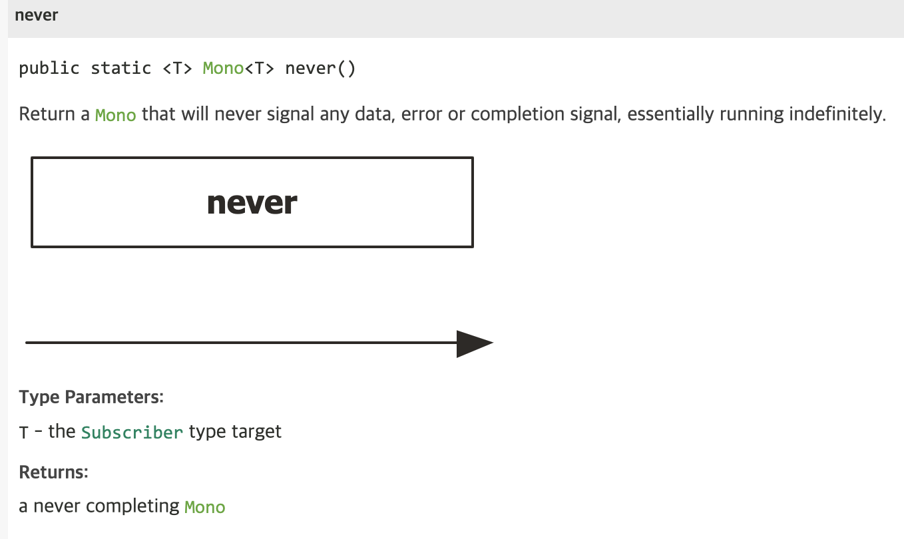
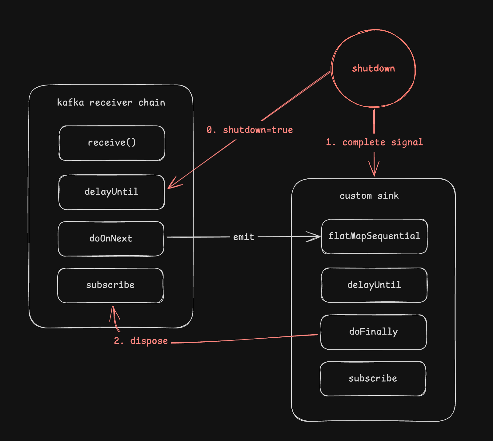

지난 약 1년 조금 넘는 기간 동안, 미들웨어 기능을 담당하는 알림 플랫폼을 구축하는 업무를 진행했다. 알림 플랫폼 구축 시 요구사항 중 하나는 알림 발송을 수신하는 서버 역할의 서비스에는 TPS 에 대한 제한이 있지만, 알림 발송을 요청하는 클라이언트의 서비스는 TPS 에 대한 제어 없이 무작위로 발송할 수 있어야 한다는 것이기 때문에, 적절한 제어와 high throughput 을 보장하기 위해 spring webflux 와 kafka 를 사용했다.

spring webflux 환경에서, kafka 를 사용할 일이 생기면 일반적으로 reactor-kafka 를 채택하기 마련이다. kafka message 의 producing/consuming 을 reactive stream chaining 을 이용해 손쉽게 구성할 수 있고, backpressure 와 같은 기능을 활용하여 throughput 을 비교적 손쉽게 다룰 수 있다는 점은 개발자에게 큰 매력으로 다가온다.

그런데, reactor-kafka 를 사용하면서 문제점을 하나 발견할 수 있었는데, 이는 바로 graceful shutdown 과 관련된 내용이다. kafka 를 다루다 보면 주의깊게 봐야 하는 부분 중 하나가 중복 처리와 관련된 내용인데, 주로 재배포시에 이러한 문제가 자주 발생한다. 그런데, reactor-kafka 를 생각없이 사용하다가는 메세지를 중복으로 소비하거나, 혹은 건너뛰게 되는 불상사가 발생할 수 있다.

오늘은 이 reactor-kafka 를 사용할 때 graceful shutdown 에 어떤 문제가 있는지 그리고 이를 어떻게 해결하는지에 대해 알아보자.

### 카프카 사용 패턴

kafka 를 이용해 메세지를 수신하고 처리하는 방법은 전형적으로 다음과 같은 패턴을 띤다.

1. 카프카 메세지를 수신한다.
2. 메세지를 처리한다. (DB에 저장하거나, 알림을 발송하는 등의 API 호출)
3. 메세지에 대한 후처리(kafka commit, 혹은 auto commit 을 위한 spring kafka ack 처리 등)

이 때, 메세지에 대한 후처리, 즉 commit 을 하는 방법은 보통 auto commit 을 할지 말지로 나뉘게 된다. 

`enable.auto.commit` 을 설정하면, `auto.commit.interval.ms` 에 설정한 값에 따라 주기적으로 백그라운드에서 commit 이 수행된다. 이 때, commit 요청은 polling api 과 함께 수행되며, 현재까지 poll 해온 offset 만큼의 commit 을 수행한다. 따라서, 중간에 리밸런싱이나 재배포와 같은 이유로 데이터 처리와 commit 이 올바르게 수행되지 않으면, 데이터의 유실 혹은 중복이 발생하게 된다.

reactive stream 이 아니더라도, 대부분의 경우 이러한 문제가 쉽게 발생할 수 있기 때문에 `enable.auto.commit` 은 false 로 두고, 코드 레벨에서 수기로 동기/비동기 방식의 commit 을 수행하는 것이 일반적이다. 따라서 reactor 를 이용해 데이터를 처리하는 코드를 구현하면 대개 다음과 같다.

```kotlin
val receiver = KafkaRecever.create(...)

receiver.receive()
	.flatMapSequential { process(it).thenReturn(it) }
	.delayUntil { it.receiverOffset().commit() }
	.subscribe()
```

위 코드를 보면 가장 먼저 데이터를 처리하는 부분을 `flatMapSequential` 로 처리하고 있는 것을 볼 수 있다. `flatMapSequntial`  은 `flatMap` 과 같이 비동기적으로 내부 publisher 를 처리하지만, 그 결과를 다음 operator(여기서는 `delayUntil`) 로 내려줄 때는 순서를 보장하므로, (즉, interleaving 되지 않는다.) offset 에 대한 commit 순서를 지키기 위해 사용하였다. 물론 상황에 따라, high throughput 이 필요없다거나, 순서를 제어할 필요가 있다거나, 혹은 여러 이유로 인해 `concatMap`, `flatMap` 등을 사용할 수도 있다.

다음으로, `delayUntil` 은 위에서 언급한대로, 동기적으로 commit 을 수행하면서, 동시에 각 offset commit 간 순서를 지키기 위해 사용하였다. 이 부분 또한 마찬가지로 경우에 따라 다른 operator 로 대체할 수 있다.

스프링 환경에서는 일반적으로 `KafkaReceiver` 를 bean 으로 등록한 뒤, 특정 서비스성 컴포넌트에서 주입받아 사용하게 된다.

그런데, 이 때 갑자기 shutdown 이 들어오면 어떻게 될까? `KafkaReceiver` 는 비록 bean 으로 등록되었지만, 별도의 shutdown 절차가 존재하지 않으므로, reactive chain 자체가 진행되던 도중 그대로 application process shutdown 으로 마무리 될것이다. 그렇다면, 이미 처리된 데이터가 아직 커밋이 되지 않아 다시 컨슘하는 중복의 문제가 발생할 수 있고, 반대로 커밋 offset 을 적절하게 제어하지 않는다면 데이터 처리가 끝나지 않았지만 죽어버리는 유실의 문제가 발생할 수도 있다. 이러한 문제를 어떻게 해결할 수 있을까 ?

### 방법 1. ❌ dispose() 사용하기

가장 먼저 떠올릴 수 있는 방법은, `subscribe()` 로 튀어나온 `Disposable` 객체에 `dispose()` 를 걸어, chain 을 캔슬시키는 방법이 있다.

```kotlin
val receiver = KafkaRecever.create(...)

val disposable = receiver.receive()
	.flatMapSequential { process(it).thenReturn(it) }
	.delayUntil { it.receiverOffset().commit() }
	.subscribe()

disposable.dispose() // <-
```

cancel 시그널을 upstream 으로 순차적으로 올려보내준다면, 진행중인 chain 이 적어도 갑작스럽게 무너지는 일은 없을 것 같아 보인다. 하지만, 여전히 문제는 남아있다. 가령, process 가 하나의 작업만 처리하는게 아니라, DB에 데이터도 저장하고, API 요청도 해야하는 등의 I/O 작업이 여러 개가 수반되어 있다면, `flatMap` 내에서 처리하는 동작의 atomicity 가 보장되지 않는다. 즉, DB 에 데이터는 저장했는데 API 요청을 못했다던가 하는 불상사가 발생한다. 따라서 이 방법은 좋지 못한 것 같다.

`dispose()` 를 사용했을 때의 문제점은, cancel 요청이 graceful 하게 처리되지 않는다는 점이다. 다른 방법을 찾아야 한다.

### 방법 2. ❌ predicate 이용하기

다음으로 떠올려 볼 수 있는 방법은, `takeWhile` 혹은 `takeUntil` 을 이용해 중간에서 멈추는 방식이다.

```kotlin
val receiver = KafkaRecever.create(...)
val shutdown = AtomicBoolean(false)

val disposable = receiver.receive()
	.takeWhile { !shutdown.get() } // <-
	.flatMapSequential { process(it).thenReturn(it) }
	.delayUntil { it.receiverOffset().commit() }
	.subscribe()
```

위와 같이 `shutdown` 변수를 하나 둔 뒤에, shutdown 요청이 들어왔을 때 `@Predestory` 등을 이용해서 해당 변수를 true 로 바꿔주면 되지 않을까 ? `takeWhile` 은 predicate 를 만족하게 되면, downstream 으로 `complete` 시그널을 내려주기 때문에, `flatMapSequential` 과 `delayUntil` 이 모두 처리되고 나서 종료될 것이다. 따라서, “이제 종료해도 될지?” 를 판단하는 여부를 `disposable.isDisposed` 로 확인하면 될 것 같다.

하지만 애석하게도, 이 방법도 올바르게 동작하지는 않는다. 왜냐하면, `takeWhile` 이 predicate 를 만족했을 때에는 downstream 으로 complete 시그널을 보내지만, 동시에 upstream 으로 cancel 을 보내기 때문이다. 

아래는 takeWhile 의 클래스 구현체인 `FluxTakeWhile`, 그리고 `TakeWhileSubscriber` 의 코드 중 일부이다. 주석으로 설명을 달아놓았다.

```java
@Override
public void onNext(T t) {
	// ...

	boolean b;

	try {
		// 조건에 만족하는지 확인한다.
		b = predicate.test(t);
	} catch (Throwable e) {
		onError(Operators.onOperatorError(s, e, t, actual.currentContext()));
		return;
	}

	// 조건에 만족하지 않으면(shutdown=true) 
	if (!b) {
		// upstream 으로 cancel 요청을, downstream 으로 onComplete 를 보낸다
		s.cancel(); // 이 때 s 는 Subscription 인스턴스
		onComplete();
		return;
	}

	actual.onNext(t);
}
```

여기까지만 보면 괜찮아보이지만, 문제는, upstream 으로 cancel 을 보냈을 때 KafkaReceiver 가 어떤 행위를 하는지이다. `KafkaReceiver` 는 infinite stream 을 다루기 위해, `Sink` 를 베이스로 만들어졌는데, 이 `Sink` 를 종료할 때, **내부에 있는 kafka consumer 를 종료하도록 처리되어있다.**. 아래는 `DefaultKafkaReceiver` 클래스 코드 중 일부이다.

```java
private <T> Flux<T> withHandler(AckMode ackMode, BiFunction<Scheduler, ConsumerHandler<K, V>, Flux<T>> function) {
	return Flux.usingWhen(
		Mono.fromCallable(() -> {
			ConsumerHandler<K, V> consumerHandler = new ConsumerHandler<>(
				receiverOptions,
				consumerFactory.createConsumer(receiverOptions),
				// Always use the currently set value
				e -> isRetriableException.test(e),
				ackMode
			);
			consumerHandlerRef.set(consumerHandler);
			return consumerHandler;
		}),
		handler -> Flux.using(
			() -> Schedulers.single(receiverOptions.schedulerSupplier().get()),
			scheduler -> function.apply(scheduler, handler),
			Scheduler::dispose
		),
		// 이 handler.close() 를 따라가다 보면, `consumer.close()` 를 호출한다.
		handler -> handler.close().doFinally(__ -> consumerHandlerRef.compareAndSet(handler, null)) // <-
	);
}
```

즉, downstream 이 모두 처리되기도 전에 consumer 가 종료되고, 따라서 downstream 에 있는 `delayUntil` operator 에서 `commit` 을 요청했지만, 이미 consumer 는 종료된 상태이므로 올바르게 커밋이 처리되지 않는다.

> 참고로, `handle` operator 또한 downstream 으로 complete 시그널을 방출하면 upstream 으로 cancel 을 보내도록 구현되어있다.
> 

### 방법 3. ❓ chain 자체를 halt 시키기

또 다른 방법은, 2번 방법과 비슷하지만 조금 우악스러운 면이 있다. reactor 에는 자주 쓰이지 않아 잘 알려지지 않은 operator 하나가 있는데, 바로 `never` 이다. 이 `never` operator 는, 이름 그대로 “아무것도” 하지 않는다. 



즉, `onNext`, `onComplete`, `onError` 등 아무런 signal 을 downstream 으로 내려주지 않는다. 이를 이용해 다음과 같이 kafka receiver 를 **중지**시킬수 있다.

```kotlin
val receiver = KafkaRecever.create(...)
val shutdown = AtomicBoolean(false)

val disposable = receiver.receive()
	.delayUntil {
		if (shutdown.get()) {
			Mono.never<Unit>()
		} else {
			Mono.empty<Unit>()
		}
	}
	.flatMapSequential { process(it).thenReturn(it) }
	.delayUntil { it.receiverOffset().commit() }
	.subscribe()
```

이렇게 중지시켜버리면, downstream 의 flatMap 과 delayUntil 은 정상적으로 처리될 것이다. 다만, `disposable.isDisposed` 로 모두 처리되었는지 확인할 수는 없다. 약간 아쉬운 부분이 있다.

### 방법 4. ✅ 새로운 Sink 구축하기

우리는 위 해결 방법들을 살펴보면서, 여러 힌트를 얻었다. 우리가 원하는 것은 complete 시그널을 downstream 으로 내려줘서, 모든 record 에 대한 처리가 자연스럽게 끝나기를 원한다. 그런데 reactive chain 의 중간에서 complete 시그널을 내려주는 방법은 필연적으로 upstream 으로의 cancel 을 수반하기 때문에 문제가 된다. 또한, `never` operator 를 이용해서 reactive chain 을 중단시킬수도 있다는 것을 알게 되었다.

그러면 만약, 우리가 새로운 sink 를 만들게 되면, complete 시그널에 대한 처리도 자유롭게 처리할 수 있고, 이 sink 가 모두 처리가 끝났을 때 kafka receiver 에 대한 cancel 처리를 한다면 모두 해결되지 않을까? 다음 코드가 그 고민의 결과물이다.

```kotlin
val receiver = KafkaRecever.create(...)
val shutdown = AtomicBoolean(false)
val sink = Sinks.many().unicast().onBackpressureBuffer<ReceiverRecord<String, String>>()

val kafkaDisposable = receiver.receive()
	.delayUntil {
		if (shutdown.get()) {
			Mono.never<Unit>()
		} else {
			Mono.empty<Unit>()
		}
	}
	.doOnNext { sink.tryEmitNext(it) } 
	.subscribe()
	
val sinkDisposable = sink.asFlux()
	.flatMapSequential { process(it).thenReturn(it) }
	.delayUntil { it.receiverOffset().commit() }
	.doFinally { kafkaDisposable.dispose() }
	.subscribe()

// 종료할 때가 되면
shutdown.set(false)
sink.tryEmitComplete()
```

코드로 보기에는 조금 헷갈릴 수 있을 것 같아, 그림을 그려보면 다음과 같다.



이렇게 구현함으로써 다음을 해결할 수 있게 되었다.

1. shutdown 이 진행되는 여유 기간(sigterm → sigkill 사이의 term) 동안, consume 한 모든 메세지를 처리할 수 있다.
2. 모든 메세지가 처리되었는지에 대한 확인은, `sinkDisposable.isDisposed` 로 확인할 수 있다.

물론 위 코드는 개략적인 모습일 뿐, 사실 저 코드만으로 복사해서 사용하기에는 부족한 부분이 많다.. 스프링의 shutdown hook 에 integration 도 필요하고, 데이터의 emit 처리가 너무 빠르기 때문에 적절한 back pressure 전략도 필요하다. 하지만 어찌됐든 graceful shutdown 동작에는 무리가 없어 보인다. 

### 마무리

사실 가장 좋은 방법은, reactor-kafka 메인테이너가 graceful shutdown 을 할 수 있도록 방법을 제공하는 것이다. 이를 위해 [이슈](https://github.com/reactor/reactor-kafka/issues/378)도 남겨보고, [PR](https://github.com/reactor/reactor-kafka/pull/380) 도 올려봤지만, reactor-kafka 에 대한 지원이 끊긴건지, 나를 포함한 대부분의 이슈에 대해 activity 가 1년째 끊어진 상태라, 나름대로 우회방법을 구현해보았다.

그리고, 이 글을 쓰게 된 계기는 “도대체 다른 사람들은 어떻게 하고 있을까?” 가 궁금해서가 너무 컸다. reactor-kafka 라는 프레임워크가 새삼스러운 것도 아니고, graceful shutdown 도 흔하게 고려하는 문제 중 하나이지 않은가 ? outbox pattern 등을 이용하더라도 모두 해결은 되지 않을텐데.. 다른 손쉬운 방법이 있어서 그런걸까? 잘 모르겠다. 잘 아는 분이 있으면 댓글을 남겨주면 고맙겠다.

아무튼, 이상으로 reactor-kafka 의 graceful shutdown 에 대한 고찰을 마친다.
