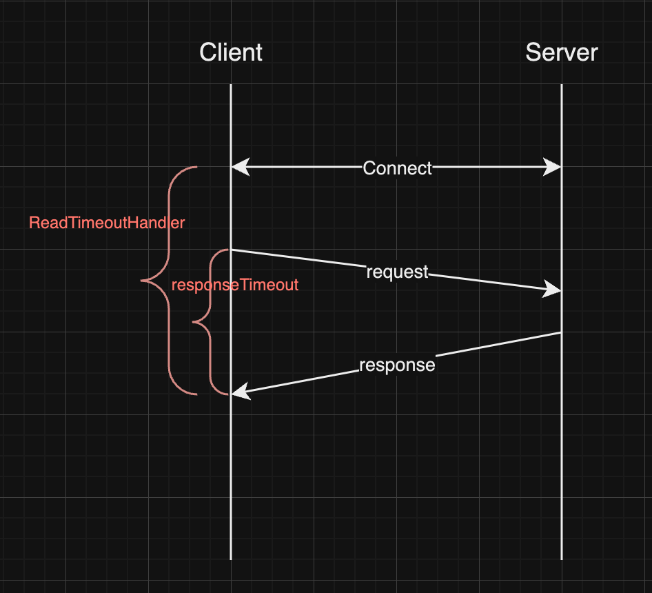
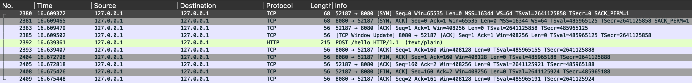
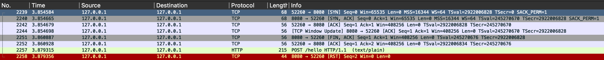

SpringBoot 환경에서 HTTP 요청을 보낼 때 주로 사용하는 client 는 `RestTemplate`  과 `WebClient`  가 있다.  RestTemplate 은 Spring 3.0 부터 포함된 client 로, mvc 환경에서 blocking I/O 방식으로 요청을 보낼 때 주로 사용되어왔고, `WebClient` 는 (비교적 ?) 최신인 5.0 부터 도입되어, webflux 환경에서 non-blocking I/O 로 요청을 보낼 때 애용되어왔다.

`WebClient` 의 connection manager 는  기본 구현체로 `reactor-netty` 를, 그리고 `reactor-netty` 는 netty 의 wrapper 로, 실상 HTTP 요청을 보내는 connection 을 관리하는 주체는 netty framework 를 사용한다. 따라서 `WebClient` 의 설정을 customize 하기 위해서는 netty, reactor-netty 의 옵션들을 알아야 한다.

아직까지도 `RestTemplate`, 그리고 스프링 6 버전부터 도입된 `RestClient` 을 사용하는 경우도 많이 찾아볼수 있고, 해당 클라이언트에서 주로 사용되는 Apache HttpClient 5 버전에도 여러 옵션들이 존재하지만, 해당 내용까지 담기에는 너무 길어질 것 같아 다음에 알아보는 것으로 하고, 오늘은 `WebClient`, 즉 netty 쪽을 알아보자.

### WebClient (reactor-netty) 옵션

webClient 에서 주로 사용하는 옵션들은 다음과 같다. (물론 netty 자체에서도 제공하는 [옵션들은 수없이 많다](https://netty.io/4.1/api/index.html?io/netty/channel/ChannelOption.html))

```kotlin
val connectionProvider = ConnectionProvider.builder("my-pool")
	.maxIdleTime(Duration.ofMillis(42))
	.maxLifeTime(Duration.ofMillis(42))
	.build();
	
val httpClient = HttpClient.create(connectionProvider)
	.doOnConnected {
		it.addHandlerLast(ReadTimeoutHandler(42, TimeUnit.MILLISECONDS))
			.addHandlerFirst(WriteTimeoutHandler(42, TimeUnit.MILLISECONDS))
	}
   .responseTimeout(Duration.ofMillis(42))

val webClient = WebClient.builder()
	.clientConnector(ReactorClientHttpConnector(httpClient))
	.build()
```

하나씩 살펴보자.

```kotlin
val connectionProvider = ConnectionProvider.builder("my-pool")
	.maxIdleTime(Duration.ofMillis(42))
	.maxLifeTime(Duration.ofMillis(42))
	.build();
```

가장 먼저 살펴볼 부분은 `maxIdleTime` 과 `maxLifeTime` 이다. `ConnectionProvider` 클래스는 개별의 connection 뿐만 아니라, connection pool 전략과 관련된 설정을 지정할 수 있다.

`maxLifeTime` 은 connection 의 전체 생명주기를 의미한다. 바꿔 말하면, connection 이 얼마나 사용되던, 사용되지 않았던 관계 없이, 한번 맺은 connection 을 얼마나 오랫동안 사용할 것인지를 의미한다. 예를 들어, `maxLifeTime` 이 10 초로 설정되어 있다면, server 에 한번 connection 을 맺고나서, 10초가 지나면 해당 connection 은 pool 에서 제거되고(기존에 해당 connection을 몇 번이고 사용했을지라도), 다시 요청을 보내려고 하면 새로운 connection 을 맺어서 요청을 보낸다.

`maxIdleTime` 은 idle 상태, 즉 사용되지 않은 connection 을 얼마나 이후에 pool 에서 제거할 것인지를 의미한다. 가령, `maxIdleTime` 이 5초라면, 0초에 요청을 보낸 뒤 5초가 될때까지 새로운 요청을 보내지 않으면 해당 connection 은 pool 에서 제거된다. 만약 3초에 요청을 보냈었다면, 8초가 될때까지는 살아있었을 것이다.

```kotlin
val httpClient = HttpClient.create(connectionProvider)
	.doOnConnected {
		it.addHandlerLast(ReadTimeoutHandler(42, TimeUnit.MILLISECONDS))
			.addHandlerFirst(WriteTimeoutHandler(42, TimeUnit.MILLISECONDS))
	}
   .responseTimeout(Duration.ofMillis(42))
```

두 번째로는 `HttpClient` 클래스에서 설정할 수 있는 옵션들로, `ReadTimeoutHandler` , `WriteTimeoutHandler`, 그리고 `responseTimeout` 이다.

`responseTimeout` 은 server 로 요청을 보내고 나서, 응답이 올 때까지 걸리는 대기 시간을 의미한다. 역시 예시를 들면, `responseTimeout` 이 3초라고 한다면, 0초에 요청을 보냈는데 server 에서 해당 요청을 처리하는데 4초가 걸렸다면 timeout 으로 exception 이 발생한다. 만약 3초 이내로 응답이 왔다면 exception 이 발생하지 않는다.

`ReadTimeoutHandler` 와 `WriteTimeoutHandler` 는 조금 특수한데, reactor 혹은 WebClient 와 관계없이, 순수하게 netty 의 TCP connection 자체(정확히는 netty 의 channel pipeline)에 거는 handler 다. `WriteTimeoutHandler` 는, 이름처럼 “쓰기”를 하는데 걸리는 시간으로, netty channel 에 write 를 요청했으나 제 시간에 완료가 되지 않는다면 exception 을 발생시킨다. `ReadTimeoutHandler`  또한 마찬가지로, netty channel 에 read 로 들어오는 시간이 설정된 값보다 넘었을 경우 exception 이 발생된다.

여기까지 살펴보면, 각 옵션들과 그 의미가 모호하게 느껴지는 부분들이 있다. 가령, `responseTimeout` 과 `ReadTimeoutHandler` 는 비슷한 역할을 하는 것으로 보이기에 둘 중 아무거나 써도 될 것 같아 보이지만, 사실은 그렇지 않다. 

### responseTimeout vs ReadTimeoutHandler

`responseTimeout` 과 `ReadTimeoutHandler` 는 둘 다 ‘응답’ 을 대기하는 속성이다. 결론부터 먼저 말하자면, `ReadTimeoutHandler` 는 특수한 상황이 아니라면 사용하는 것을 추천하지 않는다. 그 이유는, 두 개 timeout 의 tick 이 시작하는 시점이 다르기 때문이다.

앞서 `responseTimeout` 은, “요청을 보내고 나서”, 응답이 올 때까지 걸리는 대기 시간이라고 언급했다. 따라서, 이 과정은 connection 을 생성 혹은 pool 에서 가져오거나,TLS handshake 를 하는 시간을 제외한 시간이다. 즉, 순수하게 **HTTP level 에서 응답-요청까지의 interval** 을 계산한 값이다.

한편, `ReadTimeoutHandler` 의 timeout 은 connection 이 **사용되려고 하는 시점**부터 tick 이 진행된다. 바꿔 말하면, `ReadTimeoutHandler` 는 TCP 관점에서 timeout 을 측정한다. 따라서, TLS handshake 와 같은 부가적인 시간도 포함된다. 

즉, 그림으로 표현하면 아래와 같이 동작한다.



이는 간단한 테스트 코드로도 실험해볼 수 있다. 먼저, 다음과 같이 아주 간단한 controller 코드를 작성하자.

```kotlin
@PostMapping("/test")
fun test() {
	return "Hello World!"
}
```

그리고 테스트코드는 다음과 같다.

```kotlin
val httpClient = HttpClient.create()
	.doOnConnected {
		it.addHandlerLast(ReadTimeoutHandler(1000, TimeUnit.MILLISECONDS)) // (1)
	}
	.wiretap("my-wiretap", LogLevel.INFO, AdvancedByteBufFormat.TEXTUAL) // netty log 활성화
	.responseTimeout(Duration.ofMillis(1000)) // (2)

val webClient = WebClient.builder()
	.clientConnector(ReactorClientHttpConnector(httpClient))
	.build()

val body = Mono.delay(Duration.ofMillis(2000))
	.doOnNext { logger.info { "body supplied" } }
	.map { "some-body" }

webClient.post()
	.uri("http://localhost:8080/test")
	.body(body)
	.retrieve()
	.bodyToMono<String>()
	.test()
	.expectNextCount(1)
	.verifyComplete()
```

위 코드를 보면, `ReadTimeoutHandler` 와 `responseTimeout` 을 둘 다 설정했는데, 실제로 테스트 코드를 실행할 때는 둘 중 하나를 주석처리 하면서 코드를 실행해보면 된다.  `body` 를 일반적인 value 가 아닌, `Mono` 로 한번 감쌌다는 점에 주목하자. 즉, webClient 를 요청하려고 connection 을 맺은 뒤, 요청을 보낼 때 body 를 2초 뒤에 제공한다.

`responseTimeout` 만을 사용했을 때의 로그는 다음과 같다.

```
2025-02-28 00:07:26.825 [reactor-http-kqueue-2] [INFO] my-wiretap - [5c518a70] REGISTERED 
2025-02-28 00:07:26.864 [reactor-http-kqueue-2] [INFO] my-wiretap - [5c518a70] CONNECT: localhost/127.0.0.1:8080 
2025-02-28 00:07:26.872 [reactor-http-kqueue-2] [INFO] my-wiretap - [5c518a70, L:/127.0.0.1:64410 - R:localhost/127.0.0.1:8080] ACTIVE 
2025-02-28 00:07:28.891 [parallel-1] [INFO] WebClientTest - body supplied 
2025-02-28 00:07:28.901 [reactor-http-kqueue-2] [INFO] my-wiretap - [5c518a70-1, L:/127.0.0.1:64410 - R:localhost/127.0.0.1:8080] WRITE: 167B POST /hello?sleep=0 HTTP/1.1
user-agent: ReactorNetty/1.2.1
host: localhost:8080
accept: */*
Content-Type: text/plain;charset=UTF-8
content-length: 9

some-body 
2025-02-28 00:07:28.902 [reactor-http-kqueue-2] [INFO] my-wiretap - [5c518a70-1, L:/127.0.0.1:64410 - R:localhost/127.0.0.1:8080] FLUSH 
2025-02-28 00:07:28.951 [reactor-http-kqueue-2] [INFO] my-wiretap - [5c518a70-1, L:/127.0.0.1:64410 - R:localhost/127.0.0.1:8080] READ: 127B HTTP/1.1 200 
Content-Type: text/plain;charset=UTF-8
Content-Length: 13
Date: Thu, 27 Feb 2025 15:07:28 GMT

Hello, world! 
2025-02-28 00:07:28.965 [reactor-http-kqueue-2] [INFO] my-wiretap - [5c518a70, L:/127.0.0.1:64410 - R:localhost/127.0.0.1:8080] READ COMPLETE 
```

반대로, `ReadTimeoutHandler` 만 사용했을 때는 다음과 같이 `ReadTimeoutException` 이 발생한다.

```
2025-02-27 23:55:03.117 [reactor-http-kqueue-2] [INFO] my-wiretap - [cd99e5c0] REGISTERED 
2025-02-27 23:55:03.136 [reactor-http-kqueue-2] [INFO] my-wiretap - [cd99e5c0] CONNECT: localhost/127.0.0.1:8080 
2025-02-27 23:55:03.140 [reactor-http-kqueue-2] [INFO] my-wiretap - [cd99e5c0, L:/127.0.0.1:63968 - R:localhost/127.0.0.1:8080] ACTIVE 
2025-02-27 23:55:04.149 [reactor-http-kqueue-2] [WARN] r.n.h.c.HttpClientConnect - [cd99e5c0-1, L:/127.0.0.1:63968 - R:localhost/127.0.0.1:8080] The connection observed an error 
io.netty.handler.timeout.ReadTimeoutException: null
2025-02-27 23:55:04.153 [reactor-http-kqueue-2] [INFO] my-wiretap - [cd99e5c0-1, L:/127.0.0.1:63968 - R:localhost/127.0.0.1:8080] CLOSE 
2025-02-27 23:55:04.154 [reactor-http-kqueue-2] [INFO] my-wiretap - [cd99e5c0-1, L:/127.0.0.1:63968 ! R:localhost/127.0.0.1:8080] INACTIVE 
2025-02-27 23:55:04.155 [reactor-http-kqueue-2] [INFO] my-wiretap - [cd99e5c0-1, L:/127.0.0.1:63968 ! R:localhost/127.0.0.1:8080] UNREGISTERED 
```

`responseTimeout` 은 body 까지 모두 전송하고 나서부터 측정을 했기 때문에 timeout 에 걸리지 않았다. 반면, `ReadTimeoutHandler` 는 body 를 전송(Mono.delay 로 body 가 생성되는 시간을 포함하여)하는 시간까지 포함했기 때문에 exception 이 발생한 것을 확인할 수 있다.

`responseTimeout` 과 관련한 이슈는 [다음 링크](https://github.com/reactor/reactor-netty/issues/1159) 에서 확인해 볼 수 있다.

### ReadTimeoutHandler vs maxIdleTime

`ReadTimeoutHandler` 가 connection 생성 이후부터 timeout 을 측정한다면, 이번에는 `maxIdleTime` 이랑도 비교해볼 수 있다. `ReadTimeoutHandler` 의 timeout 이 1000ms , `maxIdleTime` 의 timeout 이 1000ms 라고 가정해보자. 응답을 받아서, 처리 후 connection pool 에 돌아가기까지 100ms 가 걸렸다면, connection pool 에서 900ms 뒤에 `ReadTimouetHandler` 로 인해 connection 이 제거될까 ? 그렇다면 `maxIdleTime` 은 의미가 없는거 아닐까 ? 그렇지는 않다.

앞서 `ReadTimeoutHandler` 를 이야기할 때, “connection 이 생성된 시점” 이라고 말하지 않고, “connection 이 사용되려고 하는 시점” 이라고 표현하면서 동시에 bold 체를 사용한 이유가 있다.

`ReadTimeoutHandler` 자체만으로 보았을 때, timeout 은 connection 이 생성된 시점, 즉 channel 에 연결이 되는 시점부터 시작하는게 맞다. 따라서 connection pool 에 다시 되돌아가서 idle 상태로 대기중일 때에도 tick 이 계속 진행될 것이라고 생각되지만, 사실은 `doOnConnected` 에서 연결된 handler 는 한 번의 요청이 끝나면 제거된다.

```java
// reactor.netty.ReactorNetty.class
// 아래 메소드를 호출한다
static void registerForClose(boolean shouldCleanupOnClose,
		String name, // ReadTimeoutHandler
		Connection context) {
	if (!shouldCleanupOnClose) {
		return;
	}

	context.onTerminate().subscribe(null, null, () -> context.removeHandler(name));
}
```

`doOnConnected` 는, “connection 이 생성되었을 때” 뿐만 아니라, 새로운 요청을 보내기 위해 connection pool 에서 idle connection 을 꺼내올때도 해당된다. 

즉, 정리하자면 요청을 보내기 위해 connection 을 꺼내거나 새로 생성한다. 이 때 `ReadTimeoutHandler` 가 등록된다. 요청이 끝난 이후 `ReadTimeoutHandler` 는 제거되고, connection 은 pool 로 되돌아가며, 이 때부터 `maxIdleTime` 의 tick 이 진행되는 흐름이다.

### 자주 접하는 에러들

WebClient 를 사용하면서 서비스를 운영하다보면 위 에러를 자주 마주하게 된다. 

- `reactor.netty.http.client.PrematureCloseException: Connection prematurely closed BEFORE response`
- `Connection Reset By peer`

해당 에러가 발생하는 원인은 다양하지만, 만약 간헐적으로 발생한다면 주로 HTTP keep-alive 를 살펴볼 필요가 있다.  (`apache httpclient5` 에서는 idleTime 을 HTTP keep alive 헤더를 바탕으로 동적으로 생성할 수 있는 API를 제공하지만, 아직 reactor netty 에서는 확인하지 못했다) 

에러가 발생하는 상황의 흔한 예시를 들면 다음과 같다.

- connection idle time 이 해당 시간보다 길게 설정되어 있었고, 동시에 서버 측에서는 connection 에 대한 close 메세지(`TCP FIN`)를 보내주지 않고 조용히 connection 을 닫았다. 이 때, client 입장에서는 stale connection 을 이용해 요청을 보내지만, 서버측에서는 이미 닫힌 connection 이므로 `TCP RST` flag 를 응답한다
- idle time 설정이 keep-alive 헤더보다 아주 조금 작게 설정되어 있어서, connection pool 에서 connection 을 꺼내고, request 를 보내기 아주 직전에 connection 이 종료되었다.

1번 케이스의 경우, 기본적으로 서버측에서 close 를 보내주는게 맞지만, client 입장에서는 idle time 을 낮게 잡는게 최선으로 보인다. [reactor netty 레포지토리에 올라온 이슈 중 하나](https://github.com/reactor/reactor-netty/issues/764#issuecomment-1011373248) 가 이 예시에 해당한다. 

2번 케이스 또한, idle time 을 좀 더 작게 잡을 수도 있고, connection pool 전략 중 `lifo` 를 선택하는 것도 방법이다. (`ConnectionProvider.builder(”pool-name”).lifo().build()` )

lifo 전략은 connection pool 에서 connection 을 꺼낼 때, “가장 최근에 사용된”(MRU, Most Recently Used) connection 을 사용하도록 한다.  가장 최근에 사용되었다는 것은, 가장 idleTime 이 짧다는(=더 오래 살 수 있다는) 의미이므로, 상대적으로 에러가 발생할 가능성이 적다.

`PrematureCloseException` 을 던지는 위치를 찾아보면, netty 의 `channelInactive` 가 호출되었을 때, 즉 tcp 상에서는 `RST` flag 를 받았을 때, 혹은 예상치 못한 타이밍에 `FIN` flag 를 받았을 때 해당 에러를 던진다. 

```java
// reactor.netty.http.client.HttpClientOperations.class 
// 해당 함수는 `channelInactive` 에서 호출된다.
@Override
protected void onInboundClose() {
	if (isInboundCancelled() || isInboundDisposed()) {
		listener().onStateChange(this, ConnectionObserver.State.DISCONNECTING);
		return;
	}
	listener().onStateChange(this, HttpClientState.RESPONSE_INCOMPLETE);
	if (responseState == null) {
		Throwable exception;
		if (markSentHeaderAndBody()) {
			exception = AbortedException.beforeSend();
		}
		else if (markSentBody()) {
			exception = new PrematureCloseException("Connection has been closed BEFORE response, while sending request body");
		}
		else {
			exception = new PrematureCloseException("Connection prematurely closed BEFORE response");
		}
		listener().onUncaughtException(this, addOutboundErrorCause(exception, unprocessedOutboundError));
		return;
	}
	super.onInboundError(addOutboundErrorCause(new PrematureCloseException("Connection prematurely closed DURING response"),
			unprocessedOutboundError));
}
```

이 역시 다음의 간단한 코드로 netty 서버를 띄워서 테스트해볼 수 있다.

```kotlin
fun main() {
	val bossGroup = NioEventLoopGroup()
	val workerGroup = NioEventLoopGroup()

	try {
		ServerBootstrap()
			.group(bossGroup, workerGroup)
			.channel(NioServerSocketChannel::class.java)
			.childHandler(object : ChannelInitializer<SocketChannel>() {
				override fun initChannel(ch: SocketChannel) {
					ch.pipeline().addLast(RudeServerHandler())
				}
			})
			.bind(8080).sync().channel().closeFuture().sync()
	} finally {
		bossGroup.shutdownGracefully()
		workerGroup.shutdownGracefully()
	}
}

private class RudeServerHandler : ChannelInboundHandlerAdapter() {
	override fun channelActive(ctx: ChannelHandlerContext) {
		// (1)
		ctx.close().await()
	}

	override fun channelRead(ctx: ChannelHandlerContext, msg: Any) {
		// (2)
		ctx.close().await()
	}
	
	override fun exceptionCaught(ctx: ChannelHandlerContext, cause: Throwable) {
		cause.printStackTrace()
		ctx.close()
	}
}
```

main 부분은 서버를 띄우는 부분이라 크게 볼 건 없고, `RudeServerHandler` 의 `channelActive` , 그리고 `channelRead` 부분을 살펴보면 된다. `channelActive` 함수는 connection 이 연결되었을 때, 그리고 `channelRead` 는 데이터를 읽을 때(모든 데이터는 아님) 호출된다. 그리고 이 타이밍에, channel(connection) 을 강제로 닫아버리고 있다.(`ctx.close().await()`). 둘 다 있을 필요는 없으므로, 하나씩 주석처리를 해가며 테스트를 해보면 된다. 먼저, `channelRead` 쪽 close 만 사용했을 때(=channelActive 쪽 코드를 주석처리 했을 때) 를 살펴보자.

예상한대로, `reactor.netty.http.client.PrematureCloseException: Connection prematurely closed BEFORE response` 에러가 발생한다. 이 때의 wireshark packet 을 보면 다음과 같다.



1~3 번째 packet(2380, 2381, 2383) 은 tcp 3-way handshake 로, 정상적인 connection 을 맺었다. 4번째 packet(2385) 은 tcp 흐름제어(sliding window)와 관련된 packet 이므로 무시하자. 5번째 packet(2392) 에서, HTTP 요청을 정상적으로 보냈고, 6번째 packet(2393) 은 해당 데이터를 정상적으로 받았음을 의미한다.

7번째(2404)부터, 갑작스럽게 server 에서 client 측으로 `FIN` 을 보내면서, connection 을 닫는다. client 입장에서는 request 를 제대로 보냈으나 갑작스럽게 `FIN` 으로 connection 을 닫으라는 메세지를 받았으므로, 예상치 못한 상황이라 예외를 던진다. 에러 메세지 `Connection prematurely closed BEFORE response` 가 어떤 의미인지 이해가 될 것이다.

이번에는 반대로 `channelActive` 쪽 close 만 사용해보자. 이번에는 기존과 달리 `Connection reset by peer` 에러가 발생한다. 이 또한 packet 을 살펴보자.



1~4 번째 packet(2239, 2240, 2242, 2244) 은 기존과 동일하게, 3-way handshake 이후 sliding window 를 위한 packet 을 주고받았다. 5번째 packet(2251) 에서,TCP 연결을 맺자마자, server 측에서 `FIN` 을 보내 connection 종료를 보내는 것을 볼 수 있다. 그러나 7번째 packet(2257) 에서 client 는 이미 종료된 connection 에 대해 요청을 보내버렸고, server 측에서는 “난 이미 종료했는데?” 라며 `RST` 플래그를 응답한것이다. 

> 6번째 packet 에서, server 의 `FIN` 에 client 가 `ACK` 으로 응답했음에도 요청을 보낸 이유는 비동기적인 측면이 원인으로 추측하고 있다. reactor netty 에서는 요청을 한창 보내려고 준비중인 와중에, netty framework 가 우선 `ACK` 을 먼저 응답하고, 요청을 중단하려고 보니까 이미 데이터는 요청된 것으로 보인다.
> 

만약 본인이 webClient 를 사용하다가, 해당 에러가 발생하는데 정확히 무슨 원인인지 파악하기 어렵다면 위 내용을 참고하여 다음의 공식문서를 참고하는 것도 도움이 될 것 같다.

[https://projectreactor.io/docs/netty/release/reference/faq.html#faq.connection-closed](https://projectreactor.io/docs/netty/release/reference/faq.html#faq.connection-closed)
